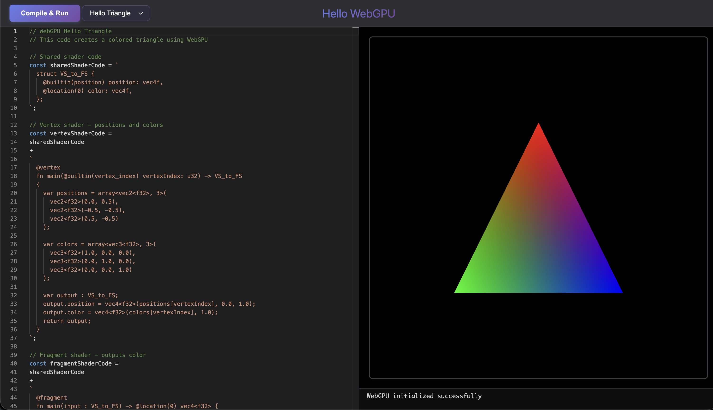

# WebGPU Example Browser and Editor

A WebGPU example browser that allows you to edit the examples and see your changes.

Check it out at: [https://forestcsharp.github.io/HelloWebGPU/](https://forestcsharp.github.io/HelloWebGPU/)



## Features

- **Monaco Editor**: Full-featured TypeScript code editor with syntax highlighting and IntelliSense
- **WebGPU Support**: Real-time WebGPU rendering in the canvas output
- **Console Output**: Captures and displays console.log, console.error, and console.warn
- **Live Compilation**: Transpiles TypeScript to JavaScript and executes in real-time
- **Render Loop**: Automatically manages animation frames for continuous rendering

## Quick Start

```bash
# Install dependencies
bun install

# Start development server
bun run dev
```

Then open your browser to the URL shown in the terminal.

## Usage

1. Write TypeScript code in the left pane
2. Click the **Compile & Run** button (or use keyboard shortcut)
3. See WebGPU output in the top-right canvas
4. View console output in the bottom-right pane

### Example Code Structure

Your code will receive WebGPU context automatically:

```typescript
// device, context, and format are injected automatically
const pipeline = device.createRenderPipeline({
  layout: 'auto',
  vertex: {
    module: device.createShaderModule({
      code: `
        @vertex
        fn main(@builtin(vertex_index) vertexIndex: u32) -> @builtin(position) vec4f {
          // ... vertex shader
        }
      `,
    }),
    entryPoint: 'main',
  },
  fragment: {
    module: device.createShaderModule({
      code: `
        @fragment
        fn main() -> @location(0) vec4f {
          return vec4f(1.0, 0.0, 0.0, 1.0);  // Red
        }
      `,
    }),
    entryPoint: 'main',
    targets: [{ format }],
  },
});

// Return a renderer object with a render method
return {
  render() {
    const encoder = device.createCommandEncoder();
    const pass = encoder.beginRenderPass({
      colorAttachments: [
        {
          view: context.getCurrentTexture().createView(),
          clearValue: [0, 0, 0, 1],
          loadOp: 'clear',
          storeOp: 'store',
        },
      ],
    });
    pass.setPipeline(pipeline);
    pass.draw(3);
    pass.end();
    device.queue.submit([encoder.finish()]);
  },
};
```

## Scripts

- `bun run dev` - Start development server with hot reload
- `bun run build` - Build for production
- `bun run preview` - Preview production build
- `bun run typecheck` - Run TypeScript type checking
- `bun run lint` - Run linter
- `bun run format` - Format code with Prettier

## Dependencies

- `monaco-editor` - Code editor component
- `@monaco-editor/loader` - Monaco editor loader
- `typescript` - TypeScript compiler for transpilation
- `vite` - Build tool and dev server

## Browser Support

Requires a modern browser with WebGPU support:

- Chrome 113+
- Edge 113+
- Firefox (behind flag)
- Safari (in development)

## Architecture

### Editor (`src/editor.ts`)

- Monaco editor integration for TypeScript editing
- TypeScript transpilation using the `typescript` package
- Code execution in a sandboxed `Function` context
- WebGPU context injection (device, context, format)
- Console output capture and display
- Render loop management for WebGPU

### Code Execution Flow

1. User writes TypeScript code in editor
2. User clicks "Compile & Run" button
3. Code is transpiled using `ts.transpileModule()`
4. TypeScript errors are shown if present
5. WebGPU is initialized (adapter, device, context)
6. Code is executed with WebGPU context injected
7. If code returns a renderer with `render()` method, a render loop starts
8. Console output is captured and displayed

## Limitations

### No Top-Level Async/Await

Since code is executed via `new Function()`, top-level `await` is not supported.

**Don't do this:**

```typescript
const data = await fetch(url); // Error!
```

**Instead, use synchronous XMLHttpRequest:**

```typescript
function loadSync(url: string): string {
  const xhr = new XMLHttpRequest();
  xhr.open('GET', url, false);
  xhr.send();
  return xhr.responseText;
}
```

## Project Structure

```
├── src/
│   ├── main.ts              # Application entry point
│   ├── editor.ts            # Monaco editor and code execution
│   └── style.css           # Global styles
├── index.html              # HTML entry point
├── package.json            # Dependencies and scripts
├── tsconfig.json           # TypeScript configuration
├── vite.config.ts          # Vite configuration
└── README.md               # This file
```

## License

MIT
